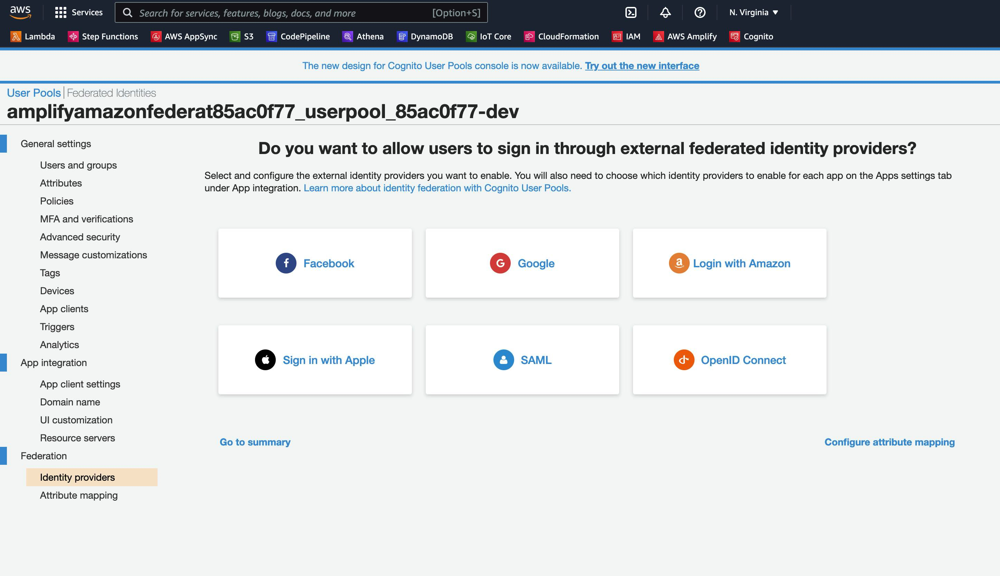

# Amplify Auth with Amazon Federate

This sample project uses Amplify Auth with Amazon Federate (Midway / Yubi Key) as the federated authentication provider.

## Configure Amplify Auth
Once you have initialized your Amplify project with **amplify init**, add the auth category to your project with the following settings.

```bash
$ amplify add auth

 Do you want to use the default authentication and security configuration? 
  Default configuration 
❯ Default configuration with Social Provider (Federation) 
  Manual configuration 
  I want to learn more. 

 How do you want users to be able to sign in? (Use arrow keys)
❯ Username 
  Email 
  Phone Number 
  Email or Phone Number 
  I want to learn more. 

 Do you want to configure advanced settings? 
  No, I am done. 
❯ Yes, I want to make some additional changes. 

 What attributes are required for signing up? 
 ◯ Address (This attribute is not supported by Facebook, Google, Login With Amazon, Signinwithapple.)
 ◯ Birthdate (This attribute is not supported by Login With Amazon, Signinwithapple.)
❯◯ Email
 ◯ Family Name (This attribute is not supported by Login With Amazon.)
 ◯ Middle Name (This attribute is not supported by Google, Login With Amazon, Signinwithapple.)
 ◯ Gender (This attribute is not supported by Login With Amazon, Signinwithapple.)
 ◯ Locale (This attribute is not supported by Facebook, Google, Signinwithapple.)

 Uncheck the Email attribute

Do you want to enable any of the following capabilities? (Press <space> to select, <a> to toggle all, <i> to invert selection)
❯◯ Add Google reCaptcha Challenge
 ◯ Email Verification Link with Redirect
 ◯ Add User to Group
 ◯ Email Domain Filtering (denylist)
 ◯ Email Domain Filtering (allowlist)
 ◯ Custom Auth Challenge Flow (basic scaffolding - not for production)
 ◯ Override ID Token Claims

 What domain name prefix do you want to use? <accept the default value or specify your own>

 Enter your redirect signin URI: http://localhost:3000/
 ? Do you want to add another redirect signin URI (y/N) N

Enter your redirect signout URI: http://localhost:3000/
? Do you want to add another redirect signout URI (y/N) N

 Select the social providers you want to configure for your user pool: (Press <space> to select, <a> to toggle all, <i> to invert selection)
❯◯ Facebook
 ◯ Google
 ◯ Login With Amazon
 ◯ Sign in with Apple

Leave these all unchecked
```

*Note - the trailing backslash in the redirect URLs is required*

Then push your project to AWS

```bash
$ amplify push
```

## Create Amazon Federate Service Profile

Logon to Amazon Federate at **https://integ.ep.federate.a2z.com/**

When creating your profile, make sure to enable a **client secret** and save the value.  You will need the client id and secret to configure Cognito.

When prompted for the **redirect URI** use the domain created in the amplify auth sequence followed by */oauth2/idpresponse*.   It will look something like:

```
https://XXXXXXXXXXX.auth.us-east-1.amazoncognito.com/oauth2/idpresponse
```

You can find this value in the *aws-exports.js* file of you application under oauth domain

```json
"oauth": {
    "domain": "XXXXXXXXXXX.auth.us-east-1.amazoncognito.com",
    "scope": [
        "phone",
        "email",
        "openid",
        "profile",
        "aws.cognito.signin.user.admin"
    ],
    "redirectSignIn": "http://localhost:3000/",
    "redirectSignOut": "http://localhost:3000/",
    "responseType": "code"
}
```
## Update the Cognito User Pool

From your Cognito User Pool in the AWS Console, select Identity Providers, and click **OpenID Connect**




Enter the Client ID and Client Secret from your Amazon Federate service profile.

Keep all other values as depicted:


Then, click the **Run discovery** button

Then select **App client settings** from the user pool menu.


Uncheck all **Enabled Identity Providers** except **AmazonFederate** and click Save Changes

*Note - Amplify creates 2 App Clients.  Either confirm which one your app is using in the aws-exports.js file, or make this change to both clients.*

## Update Your Application

This sample is a React app. Copy and paste the contents of the **App.tsx** file into your application's App.tsx file.

The application simply displays a Signin With Midway button if the user is not signed in.  Once clicked, the button will initiate the Midway sign in sequence.  Once authenticated, the app will display a Sign Out button.

The name of the **customProvider** must match what you named the OIDC profile in your Cognito Federated Identities profile.

```javascript
<button onClick={() => Auth.federatedSignIn({customProvider: "AmazonFederate"})}>Signin With Midway</button>
```